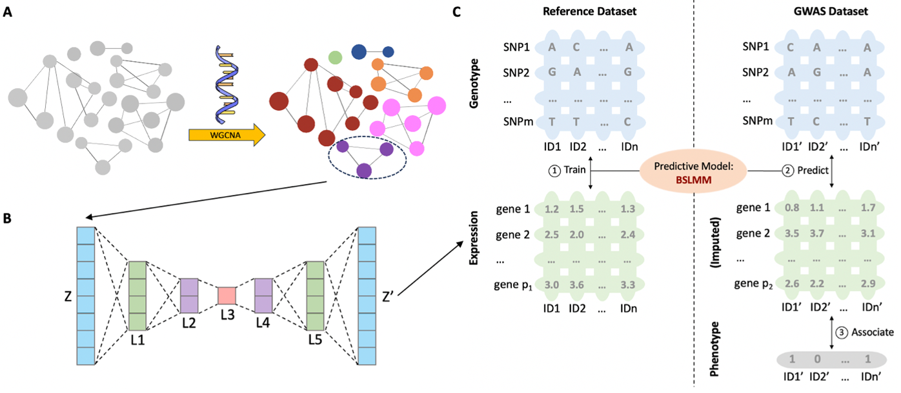

# Users’ Manual of AE-TWAS
## Overview
Transcriptome-wide association study (TWAS) is an emerging model leveraging gene expressions to direct genotype-phenotype association mapping. A key component in TWAS is the prediction of gene expressions; and many statistical approaches have been developed along this line. However, a problem is that many genes have low expression heritability, limiting the performance of any predictive model. In this work, hypothesizing that appropriate denoising may improve the quality of expression data (including heritability), we propose AE-TWAS, which adds a transformation step before conducting standard TWAS. The transformation is composed of two steps by first splitting the whole transcriptome into co-expression networks (modules) and then using autoencoder (AE) to reconstruct the transcriptome data within each module. This transformation removes noise (including nonlinear ones) from the transcriptome data, paving the path for downstream TWAS. We applied AE-TWAS to the GTEx whole blood transcriptome data and GWAS data of five human diseases, showing two inspiring properties of AE-TWAS: (1) After transformation, the transcriptome data enjoy higher expression heritability at the low-heritability spectrum and possess higher connectivity within the modules. (2) The transferred transcriptome indeed enables better performance of TWAS; and moreover, the newly formed highly connected genes (i.e., hub genes) are more functionally relevant to diseases, evidenced by their functional annotations and overlap with TWAS hits. Taking together, we show that autoencoder transformation produces “better” transcriptome, which in turn enables improved expression-assisted genotype-phenotype association mapping. The impact of this work may be beyond the field of gene mapping: AE can be deemed as a nonlinear extension of principal component analysis (PCA) that is used for removing artifacts in expression data routinely. As such, this work may inspire more expression-based applications to be carried out after an appropriate AE-transformation, unlocking the use of AE-denoised transcriptome in many fields.

## Installation
**Step1:** Preprocess transcriptome data by clustering genes into distinct modules using weighted gene co-expression network analysis (WGCNA).

We chose whole-blood gene expression data with 670 subjects as transcriptome and used gencode.v26.GRCh38.genes.gtf as gene model file downloaded from Genotype-Tissue Expression Project version 8 (GTEx v8) (https://gtexportal.org/home/datasets). Covariates, including genotyping principal components (PCs), were obtained from GTEx portal (https://gtexportal.org/home/datasets). For each gene, we adjusted the gene expression for the top five genotyping PCs, age, sex, sequencing platform, PCR protocol, and 60 confounding factors using a probabilistic estimation of expression residuals (PEER) analysis. There is a description of how to download and use the PEER tool: https://github.com/PMBio/peer/wiki/Tutorial. 

WGCNA is an R package consisting of a comprehensive collection of R functions for performing various aspects of weighted correlation network analysis. Users need to first install R and R studio, and then install the WGCNA package (https://cran.r-project.org/web/packages/WGCNA/WGCNA.pdf). We followed a step-by-step protocol for network construction and module detection. The power $\beta$ in adjacency matrix was set as 16, which was the lowest at which the scale-free topology fit index reached 0.8.

**Step2:** Apply a seven-layer conventional AE to the genes within each module clustered by WGCNA. 

We used the PyTorch package to train AE models: https://pytorch.org/. The seven-layer conventional AE consists of one input layer, one output layer, and five hidden layers. Within each module, let $Z$ represents the original input and $Z'$  is the reconstructed output. We refer $Z'$ as the AE-transformed transcriptome. Let $q$ be the number of nodes in the input and output layers, then the number of nodes in each of the five hidden layers are $q/2$, $q/4$, $q/8$, $q/4$, and $q/2$ respectively. 

**Step3:** Use the transformed transcriptome $Z'$ to carry out TWAS. It employs the BSLMM to train the genotype-expression model in the reference dataset and then associates the predicted gene expressions to the traits in the target GWAS dataset. 

**3-1:** Use BSLMM to train the genotype-expression model in the reference dataset:  
GTEx whole genome sequencing data: https://www.ncbi.nlm.nih.gov/projects/gap/cgi-bin/study.cgi?study_id=phs000424.v9.p2  
BSLMM model used to train the genotype-expression model: https://github.com/genetics-statistics/GEMMA

**3-2:** Associates the predicted gene expressions to the traits in the target GWAS dataset  
Three GWAS dataset used:  
WTCCC dataset: https://www.wtccc.org.uk/  
MSSNG database: https://research.mss.ng/  
Schizophrenia dataset: https://www.ncbi.nlm.nih.gov/projects/gap/cgi-bin/study.cgi?study_id=phs000473.v2.p2

Elastic net model used to perform gene-trait association: https://github.com/hakyimlab/MetaXcan

## Post analysis
### Calculation of expression heritability
GCTA is used to calculate gene expression heritability: https://yanglab.westlake.edu.cn/software/gcta/#Overview  
`Rscript ./code/post1.R`

### Calculation of gene pairs’ correlation and gene’s connectivity 
`Rscript ./code/post2.R`

### Functional verification of discovered genes
DisGeNET repository used to perform functional gene-disease analysis: https://www.disgenet.org/  
`Rscript ./code/post3.R`

### Figures
`Rscript ./code/figures.R`

## Contacts
Jiayi Bian: jiayi.bian@ucalgary.ca  
Qing Li: qing.li2@ucalgary.ca  
Quan Long: quan.long@ucalgary.ca

## Copyright License (MIT Open Source)
Permission is hereby granted, free of charge, to any person obtaining a copy of this software and associated documentation files (the "Software"), to deal in the Software without restriction, including without limitation the rights to use, copy, modify, merge, publish, distribute, sublicense, and/or sell copies of the Software, and to permit persons to whom the Software is furnished to do so, subject to the following conditions:

The above copyright notice and this permission notice shall be included in all copies or substantial portions of the Software. THE SOFTWARE IS PROVIDED "AS IS", WITHOUT WARRANTY OF ANY KIND, EXPRESS OR IMPLIED, INCLUDING BUT NOT LIMITED TO THE WARRANTIES OF MERCHANTABILITY, FITNESS FOR A PARTICULAR PURPOSE AND NONINFRINGEMENT. IN NO EVENT SHALL THE AUTHORS OR COPYRIGHT HOLDERS BE LIABLE FOR ANY CLAIM, DAMAGES OR OTHER LIABILITY, WHETHER IN AN ACTION OF CONTRACT, TORT OR OTHERWISE, ARISING FROM, OUT OF OR IN CONNECTION WITH THE SOFTWARE OR THE USE OR OTHER DEALINGS IN THE SOFTWARE.
